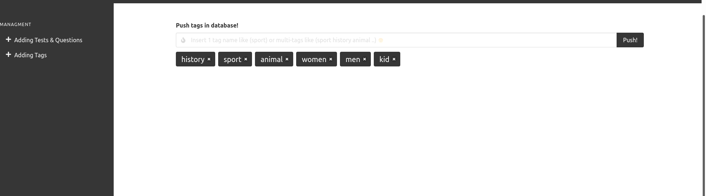

### Dashboard To Quiz API

#### Firt of all:

```bash
cd dashboard-quiz-supabase
npm install
```

`this project developed with 💙 + Bulma,Svelte {Svelma 🌻} + Supabase 🔥`

#### Screenshot: adding data




You will find supabase configs in `src/supabase.js`

----

by zakaria chahboun in 01/09/2021