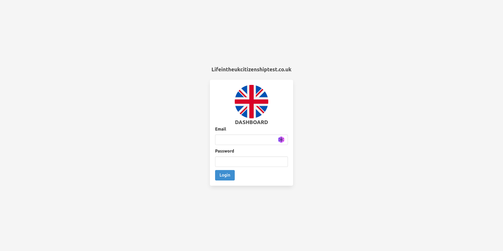
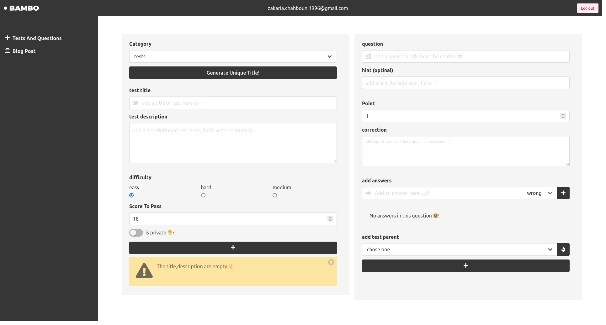
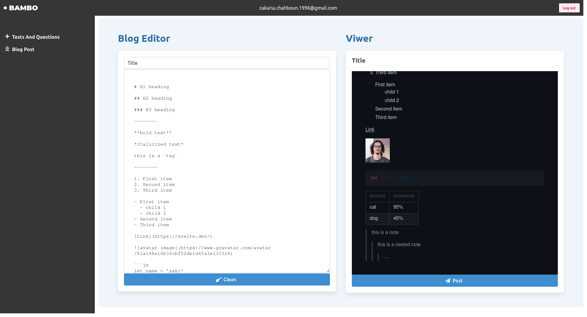

# Dashboard To Life-In-The-Uk-Test API

## Install Dependencies:

```console
cd dashboard-quiz-supabase
npm install
```

Run in dev mode

```console
npm run dev
```

This project developed with 💙 + `Svelma = Bulma css + Svelte` + `Supabase`

## Screenshots







You will find Supabase configs in `src/supabase.js`

---

created by zakaria chahboun in 01/09/2021
